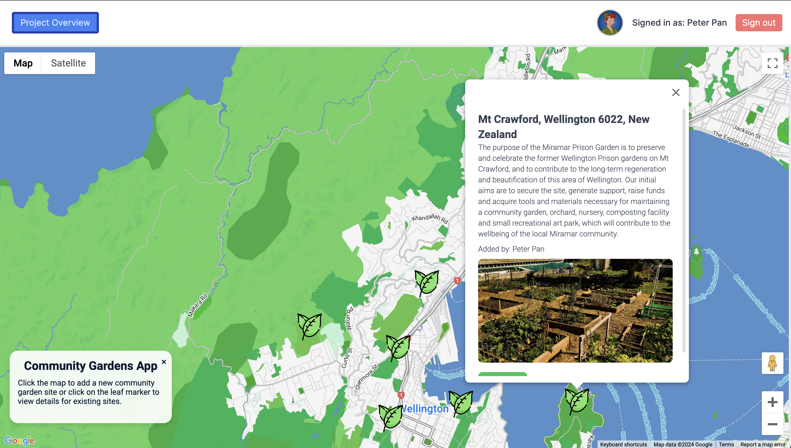
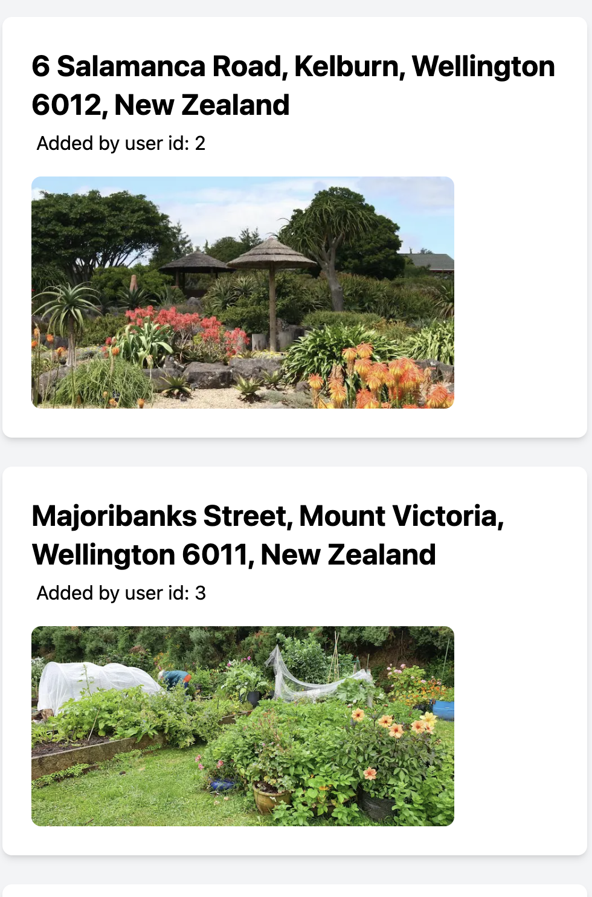

## Project Overview ##
The Community Gardens App is designed to help users locate and add community garden sites. Users can click on the map to add new garden sites or click on existing markers to view details about the gardens. The app leverages various modern web technologies to provide a seamless and interactive user experience.

# Plan #
The plan for the Community Gardens App includes the following steps:

Develop a user-friendly interface for interacting with the map.
Implement authentication to allow users to add and manage garden sites.
Integrate with Google Maps API for map functionalities.
Use Prisma and SQLite for database management.
Deploy the application using Next.js for server-side rendering.

# Barriers
Some of the barriers encountered during the development of the Community Gardens App include:

Handling asynchronous data fetching and state management in React.
Ensuring responsive design across different devices.
Managing authentication and user sessions securely.
Integrating various APIs and ensuring smooth interaction between them.

# Learnings
Effective use of React hooks for state and side-effect management.
Importance of responsive design and mobile-first approach.
Best practices for integrating third-party APIs like Google Maps.
Handling authentication and authorisation in a secure manner.

# Technology
Next.js: Used for building the server-side rendered application.
React: Used for building the user interface components.
Prisma: Used as an ORM to interact with the database.
SQLite: Used as the database for storing garden site information.
NextAuth: Used for authentication and managing user sessions.
Tailwind CSS: Used for styling the application.
Google Maps API: Used for map functionalities and displaying markers.

# Future
Future plans for the Community Gardens App include:
Adding more detailed information and images for each garden site.
Implementing user reviews and ratings for garden sites.
Enhancing the search functionality to filter garden sites based on various criteria.
Expanding the app to support multiple languages.
Integrating social media sharing features to promote community gardens.

